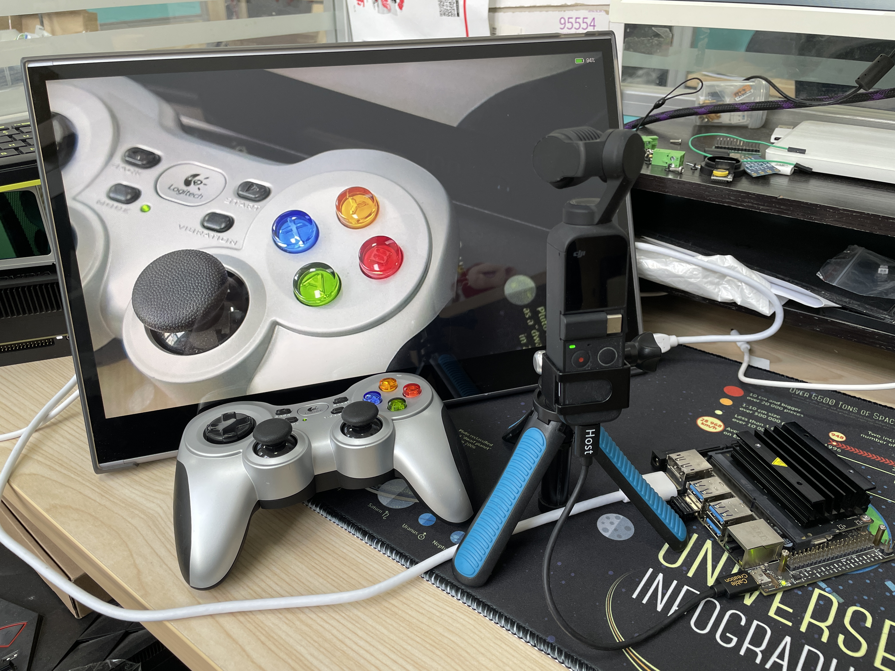

# Pocket2-Viewer
Use Jetson Nano to control dji pocket2 and output HDMI video.

## Pocket2-Viewer
The Jetson Nano can connect to DJI pocket2 camera through micro usb, and the video stream of pocket2 is obtained with the Jetson nano and output to the HDMI display, and we can control the pocket2 through the F710 game controller.

**Picture**

**Related video:**

**youtube:**  [Pocket2 HDMI OUTPUT](https://youtu.be/1BQJLwLp5gw),  [POcket2 Control through F710](https://youtu.be/A-PpPbcsgoo)

**bilibili:**  [Pocket2 HDMI OUTPUT](https://www.bilibili.com/video/BV1eQ4y1S7bo?share_source=copy_web),  [POcket2 Control through F710](https://www.bilibili.com/video/BV1B5411A7ad?share_source=copy_web)

## Download image
Files: Can be downloaded from [google drive](https://drive.google.com/file/d/1-3kpGp--eONfkuGWKmV0rN1B3X5HYmDN/view?usp=sharing)

## Instruction
**Requeriments:**
1. Minimal Sdcard will be 32GB and higher.
2. A type-C to micro USB data cable.
3. user: dji
4. password: dji
5. Logitech F710 game controller(not necessary).

**USE:**
1. A type-C to micro USB data cable is used to connect the pocket2 and the Jetson nano.
2. Jetson nano is connected to the HDMI display.
3. Jetson nano is connected to the F710 game controller through usb.
4. Power on pocket2, wait about 20s for hdmi display.

**F710 Control:**

